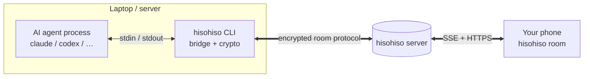
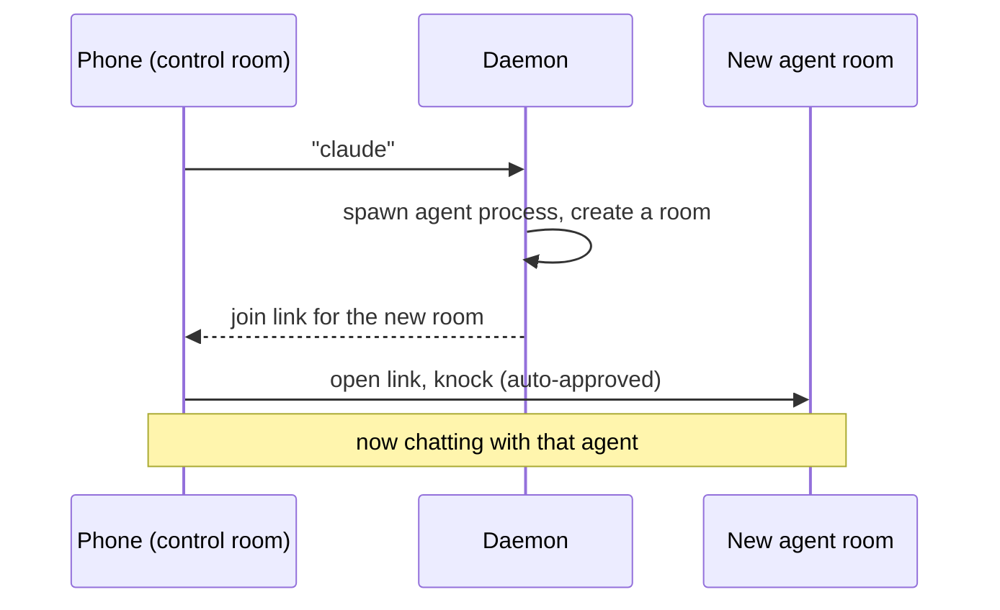

# The CLI — a terminal agent in a room

The `hisohiso` CLI (in `cli/`, TypeScript on Bun) does one thing: it puts a
command-line program — usually an AI coding agent like Claude or Codex — into a
hisohiso room as a participant. The agent's output streams to your phone; what
you type on your phone goes into the agent's stdin.

It speaks the **exact same encrypted protocol** the web app does. To the server,
the CLI is just another browser. Nothing about the room or crypto is special-
cased for it.



## Two ways to run it

### wrap — one agent, one room

The simple case. Create a throwaway encrypted room, print a QR, bridge one
agent to whoever joins:

```sh
hisohiso wrap claude
```

Scan the QR, knock, the CLI auto-approves, and now you're talking to the agent
from your phone. `Ctrl+C` disbands the room and exits. Good for "I want to
drive Claude from my phone for the next hour."

### daemon — a control room that spawns agents on demand

The CLI runs a persistent **control room**. From your phone you send it
commands and it spins up agent sessions in their own rooms, handing back a join
link each time — so you never have to go back to the laptop to start a new
session.

```sh
hisohiso daemon start     # foreground; prints the control-room QR on first run
hisohiso daemon status
hisohiso daemon stop
```

From the control room on your phone:

| You send | You get |
| --- | --- |
| `claude` | A new Claude session in its own room + a join link |
| `list` | The agent rooms currently running |
| `kill <id>` | Stops that session |
| `help` | The command list |



Daemon rooms are created with **offline catch-up on** (see
[offline-catchup.md](offline-catchup.md)), because the whole point is that the
agent keeps working while your phone is closed — and you still see what it said
when you reopen.

## How the bridge works

The interesting plumbing, file by file (`cli/src/`):

| File | Job |
| --- | --- |
| `lib/crypto.ts` | The same key derivation + AES/ECDH the web app does, in Node/Bun crypto |
| `lib/api-client.ts` | Talks to the PHP API (create, knock, approve, message, …) |
| `lib/sse-client.ts` | Subscribes to Mercure; the stall-watchdog reconnect from [realtime.md](realtime.md) lives here |
| `lib/room-bridge.ts` | The glue: room events ⇄ agent process |
| `lib/agent-process.ts` | Spawns and manages the wrapped CLI process |
| `lib/agents.ts` | The built-in agent profiles (claude, codex, …) |
| `lib/preamble.ts` + `preambles/` | The system prompt that teaches an agent to emit phone-friendly blocks |
| `lib/control-protocol.ts` | The control-room command language (`claude`, `list`, `kill`) |
| `daemon/agent-manager.ts` | Tracks running sessions, spawns/kills them |
| `lib/updater.ts` | Tick-based silent self-update |

The **preamble** is what makes the experience good: it instructs the agent to
respond with the structured blocks the app renders (diffs, buttons, confirm
dialogs) instead of walls of text. That's why a wrapped agent can show you a
diff you can approve with a tap. The block vocabulary is the same one described
in [frontend.md](frontend.md).

## Agent profiles

`claude` and `codex` are first-class: multi-turn **sessions** (the CLI resumes
the same conversation between your messages) with full block rendering. The CLI
also ships thinner one-shot profiles — `claude-once`, `codex-once`, `aider`,
`goose`, `bash`, `python` — which run a single prompt each and don't get the
session/block treatment. Run `hisohiso agents` to list them.

You can also register your own:

```sh
hisohiso daemon register myagent --command "my-tool --flag"
```

The phone's message is passed as the final argument. Handy for any CLI that
takes a single prompt — but registered agents are a thin shim, no sessions or
blocks.

## Assumptions and distribution

- The wrapped agent CLI (e.g. `claude`) must already be **installed and
  authenticated** on the machine. hisohiso doesn't install agents, set API
  keys, or run login flows — it assumes a working agent.
- By default the CLI points at `hisohiso.org`. Point it at your own server with
  `hisohiso server https://your-host`. Config lives in
  `~/.config/hisohiso/config.json`.
- Binaries are published for darwin/linux on each release tag; `install.sh`
  pulls the right one. The CLI then keeps itself updated silently in the
  background.

For running and operating the server those rooms live on, see
[stack-and-server.md](stack-and-server.md).
