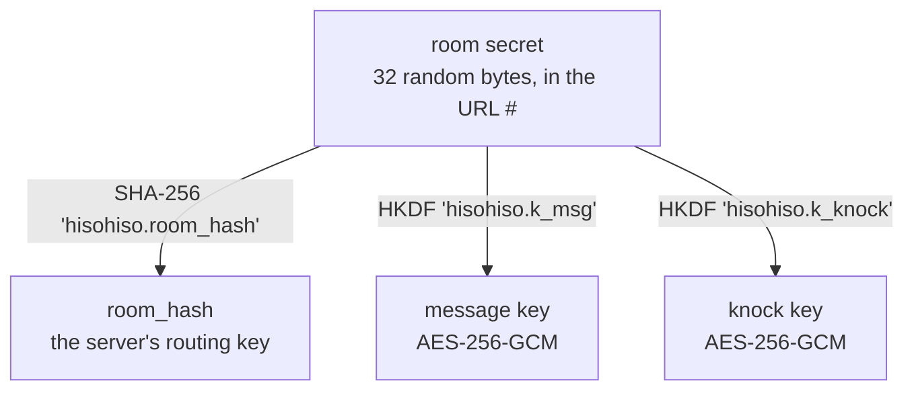
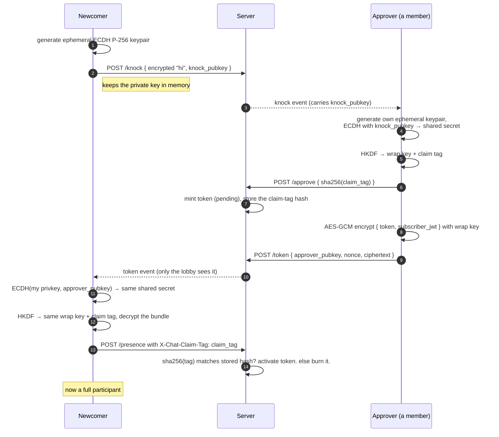

# Encryption

The whole privacy story rests on one fact: **the room secret never leaves the
browser.** Everything else is derived from it on the device, using the Web
Crypto API (`crypto.subtle`). The server only ever holds hashes and ciphertext.

Client crypto lives in `app/src/lib/crypto.ts`. The PHP side never touches a
plaintext message or a raw secret — it only hashes tokens and signs JWTs.

## What gets derived from the secret

The secret is 32 random bytes (base64url in the URL). From it the client
derives a few independent keys with HKDF-SHA256, each with its own "info"
label so they can't be confused for one another:



- **room_hash** is the only one the server sees. It's a one-way hash, so it
  can't be turned back into the secret or any of the keys.
- **message key** encrypts chat. Everyone with the secret derives the same key,
  so everyone in the room can read everyone else.
- **knock key** encrypts the little "hi, let me in" payload a newcomer sends.

If a room uses an optional **passphrase**, it's folded into the knock-key
derivation. That means knowing the link isn't enough to knock — you also need
the out-of-band passphrase. Stronger gate for the paranoid.

## Encrypting a message

AES-256-GCM, fresh 12-byte nonce per message. The clever bit is the
*associated data* (AAD): it isn't encrypted, but the tag covers it, so it can't
be tampered with. hisohiso binds each ciphertext to its context:

```
AAD = room_hash + msg_type + msg_id
```

So a ciphertext from one room can't be replayed into another, and a message
can't be passed off as a different type. The server stores and forwards the
whole `{nonce, ciphertext}` blob as an opaque string. It can't read it.

Note that the AAD covers `room_hash`, `msg_type`, and `msg_id` — but **not** the
`from` attribution. The `from` field on each event that carries it
(`from = sha256(participant_token)`) is computed and stamped by the server from
the token in the request; it is not signed by the sender and is not bound into
the ciphertext. The server cannot read or forge message *content* (that needs
the message key `k_msg`, which it never has), but it can attach an arbitrary
`from` to a garbled/junk ciphertext, or relay a genuine ciphertext under a
different `from`. In other words: who-said-it is server-asserted; what-was-said
is end-to-end encrypted.

## The join handshake (the interesting part)

The problem: a newcomer needs a **participant token** (their proof they're
allowed to POST messages), but the token must be handed over *through the
server* without the server — or anyone watching the room's event stream — being
able to steal it.

The solution is an ephemeral ECDH key exchange layered on top, plus a one-time
"claim tag" so a sniffer can't race the real joiner. Walk through it:



Why each defense is there:

- **Ephemeral ECDH wrap** — the token bundle is encrypted to a key only the
  newcomer and approver can derive. The server relays an opaque blob. A passive
  subscriber to the room's events learns nothing.
- **The token isn't in the `approve` event.** That event is just a tombstone for
  the UI ("a join was approved"). The real secret travels as the wrapped
  `token` blob on a separate, lobby-only channel.
- **The claim tag** closes a race against a *passive* sniffer. Suppose someone
  sniffs the plaintext token off the wire (they shouldn't be able to — it's
  wrapped — but suppose). The token is minted *pending* and bound to
  `sha256(claim_tag)`. To activate it you must present the matching `claim_tag`,
  which is derived from the ECDH shared secret a passive observer never sees.
  First wrong claim **burns the token**; the legitimate joiner re-knocks and the
  passive attacker is locked out.

  **What it does *not* stop: an active server-side MITM.** The ephemeral pubkeys
  (`knock_pubkey`, `approver_pubkey`) are relayed unauthenticated — we cannot
  authenticate them without leaking room metadata to the zero-knowledge relay. A
  malicious relay can substitute its own `knock_pubkey`, complete the ECDH with
  the approver, and derive the wrap key *and* the claim tag itself, defeating the
  burn defense. The blast radius is bounded: the attacker gains **participation
  only** (the ability to POST), **never decryption** — the message key `k_msg` is
  derived from the room secret in the link and never crosses this handshake, so a
  MITM relay still sees only ciphertext. Detecting an injected participant is the
  job of approver review and the room roster, not the claim tag.

## What an eavesdropper actually sees

Put yourself in the position of someone who has tapped the network or even
owns the server:

| They have | Can they read messages? | Why not |
| --- | --- | --- |
| The room hash | No | It's a one-way hash; no key derives from it |
| Every ciphertext in the room | No | AES-256-GCM, key never sent to server |
| Control of the room's `from` attribution | They can spoof *who* sent, not *what* was sent | `from` is server-stamped and unsigned; content stays sealed under `k_msg` |
| The whole Mercure event stream | No | Same — only wrapped/encrypted blobs flow |
| A leaked subscriber JWT | They can *subscribe*, not *decrypt* | JWT gates delivery, not content; and it expires |
| An active relay (server MITM) | No — can only inject a *participant* | Can substitute the knock pubkey to capture a token, but k_msg never crosses the handshake; gains POST rights, not plaintext |
| The plaintext URL (the secret) | **Yes** | This is the one thing that matters — guard the link |

### What they *can* still observe (content stays confidential; metadata does not)

Reading messages is the wrong bar. Plenty of *metadata* leaks even though every
body stays encrypted. Be honest about who sees what:

| Observer | Can still see | How |
| --- | --- | --- |
| Anyone with a subscriber JWT | Per-sender timing and cadence inside one room | Every event carries a stable `from` (a `sha256` of the sender's participant token — a pseudonym, **not** the token itself) and a millisecond `ts`. Bodies are ciphertext, but "sender X sent at these times" is in the clear. |
| Anyone with a subscriber JWT | Room liveness and rough size | knock / approve / settings / destroy events flow as metadata, so the room's create → active → disband cadence is visible; and because each event is tagged with a per-sender `from` pseudonym, counting the distinct ones gives a rough headcount (no event ships an actual participant count). |
| The operator (owns the box) | IP ↔ token ↔ room correlation | A live request exposes the raw client IP, the participant token in the `X-Chat-Token` header, and the room hash in the URL — all three at once, in real time. At rest the DB keeps only hashes, but the operator watches requests, not just the DB. |

This is deliberate, not a gap to be plugged: the relay is **untrusted by design** and
routes by `room_hash`, so it necessarily sees that traffic exists, when, and from
where. The `from` hash is a per-sender pseudonym, so a subscriber can tell two
messages came from the same person without learning *who* that person is; the
operator, seeing the raw IP and token alongside it, can. What none of them get is
**content** — the messages themselves stay AES-256-GCM sealed.

See [server.md](server.md#what-the-server-can-and-cant-see) for the same picture
from the server's side.

The takeaway for users is blunt: **the link is the room.** Anyone you give it to
can read everything. Anyone you don't, can't. If a link leaks, disband and make
a new room.

Next: [server.md](server.md) — exactly what the server stores and exposes.
