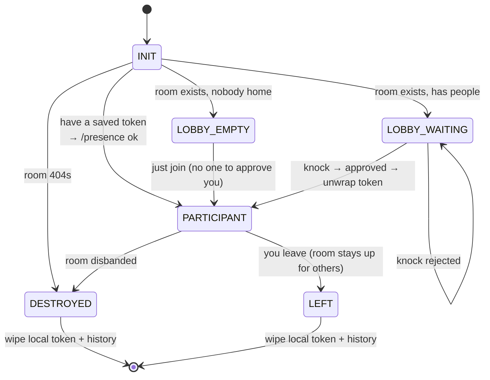

# The frontend

A React + Vite + TypeScript single-page app, styled with Tailwind, installable
as a PWA. It lives in `app/`. It does all the crypto, holds all the history,
and drives the whole protocol — the server is just its relay.

```
app/src/
├── main.tsx            entry; registers the service worker, handles mobile keyboard resize
├── App.tsx             router
├── pages/
│   ├── LandingPage.tsx     marketing
│   ├── RoomCreator.tsx     mints a secret, creates the room
│   ├── RoomsPage.tsx       your room list + QR scanner to join
│   └── RoomController.tsx  THE room — state machine, send/receive, knock/approve
├── components/
│   ├── QrModal.tsx         share-room QR
│   └── blocks/             ~20 renderers for rich message blocks (diff, buttons, …)
├── hooks/
│   └── useMessageWindow.ts virtual windowing so long rooms stay fast
└── lib/
    ├── crypto.ts       AES-GCM, HKDF, ECDH, SHA-256 (see encryption.md)
    ├── db.ts           IndexedDB via Dexie — local message history
    ├── mercure.ts      the SSE subscription (see realtime.md)
    └── storage.ts      localStorage — tokens, JWTs, handles, room list
```

`RoomController.tsx` is the heart of it; almost everything interesting happens
there or in `lib/`.

## The room state machine

A client opening a room URL doesn't know yet whether it's a member, a newcomer,
or staring at a room that no longer exists. It figures that out and moves
through these states:



- **INIT** reads the secret from the URL fragment, derives the hash, and asks
  the server what's there.
- **LOBBY_WAITING** runs the knock handshake from
  [encryption.md](encryption.md) — it holds the ephemeral keypair in a ref,
  subscribes to the lobby topic, and waits for the wrapped `token` event.
- **PARTICIPANT** is steady state: subscribe to the members topic, send/receive
  chat, ping `/presence` every ~20s, and on reconnect pull the outbox.
- **DESTROYED** calls a local wipe — token, JWT, and IndexedDB messages all go.

## Where things are stored on the device

Two stores, on purpose:

| Store | Holds | File |
| --- | --- | --- |
| **IndexedDB** (Dexie) | Decrypted message history, per room | `lib/db.ts` |
| **localStorage** | Participant token, subscriber JWT, your display handle, your room list | `lib/storage.ts` |

History is keyed by `room_hash` with a `[room_hash+timestamp]` compound index so
loading a room is a cheap range scan. The secret itself is never persisted to
storage — it only ever lives in the URL. Clear browser storage and your history
is gone; lose the URL and the room is gone.

## Rich message blocks

Messages aren't only text. A payload can carry **blocks** — structured UI like
diffs, buttons, code, confirm dialogs — rendered by `components/blocks/`. This
is what makes the CLI's phone UI work: an AI agent emits a diff or a
yes/no button and it renders natively in the room. The block types are defined
in `lib/blocks.ts` and validated before rendering. (If this looks familiar,
it's the same vocabulary the CLI agent profiles speak — see [cli.md](cli.md).)

## PWA and mobile

- **Service worker** (`public/sw.js`) — minimal; just enough to be
  installable to the home screen on iOS/Android.
- **Manifest** (`public/manifest.json`) — standalone display, starts at
  `/rooms`.
- **Keyboard handling** — `main.tsx` tracks `visualViewport` and sets an
  `--app-height` CSS variable, working around mobile Safari's broken `100vh`
  when the on-screen keyboard opens.
- **QR** — `RoomsPage.tsx` uses the camera + `jsQR` to scan a room link;
  `QrModal.tsx` generates one to share. Since the link *is* the secret, the QR
  literally is the room.

Next: [cli.md](cli.md) — putting a terminal agent into a room.
