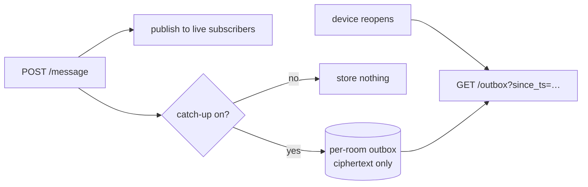
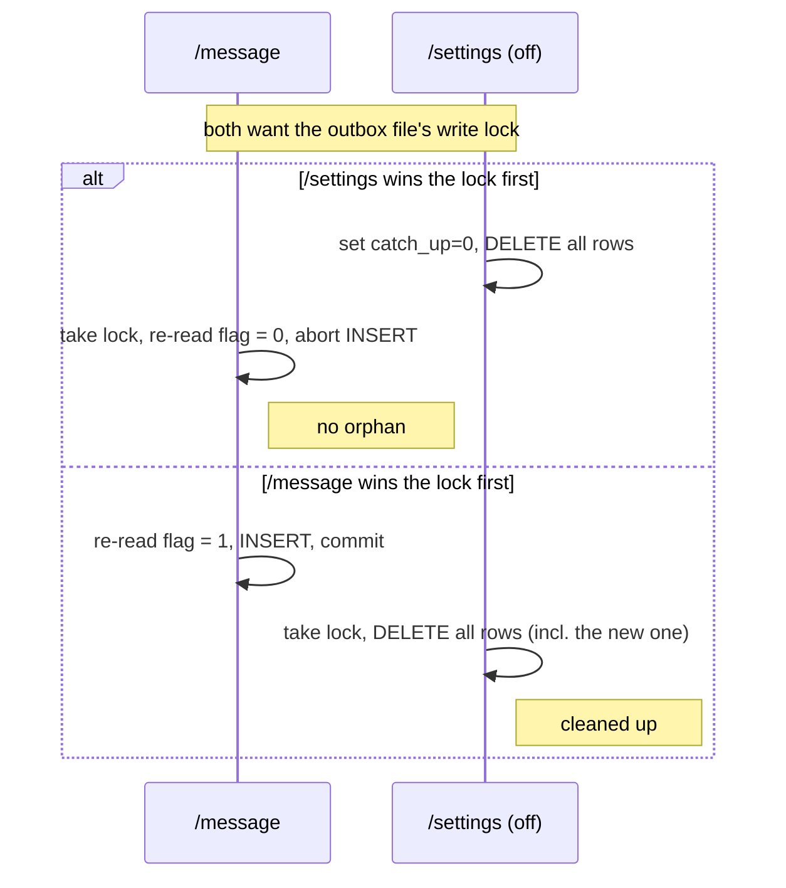

# Offline catch-up (the outbox)

SSE only delivers to connections that are *currently open*. Close the app, miss
the message. For a human chat that's often fine — but for the CLI use case (an
AI agent posting results while your phone is in your pocket) it's a real
problem. So rooms can opt into a small server-side **outbox** that stores recent
ciphertext for devices to pull when they reconnect.

It's off by default for web rooms, on by default for CLI-created rooms. Anyone
in a room can flip it from the room menu.

The code is `server/outbox.php`.

## What it stores

One isolated SQLite file **per room**, at `/data/rooms/<hash>.sqlite`. Keeping
each room in its own file means there's no shared table to leak across rooms,
and wiping a room is just dropping its rows.

It stores the **exact same ciphertext blob** the client already sent to
`/message` — nothing more. The server still can't read it.

On reconnect the client calls `GET /api/rooms/<hash>/outbox?since_ts=<last>` and
gets back everything newer than its last-seen timestamp, then decrypts it
locally like any other message.

## Retention

Deliberately small — this is a catch-up buffer, not history:

- **At most 500 messages** per room (oldest pruned past that).
- **At most 24 hours** old (pruned on both write and read).
- Whichever limit hits first wins.

Turning catch-up **off** wipes the stored ciphertext immediately. Disbanding the
room wipes it too. The toggle means what it says.

## The concurrency bit (why it's a row-delete, not a file-delete)

There's a subtle race: what if a message arrives at the exact moment someone
turns catch-up off? You don't want one orphan message stranded in the outbox
after the operator thinks they've disabled it.

The fix is that `outbox_append` (write a message) and `outbox_wipe` (clear on
disable/disband) both take a `BEGIN IMMEDIATE` lock on the same file, so they
can't run at once. And crucially, `outbox_append` **re-reads the catch-up flag
inside that lock**:

The wipe uses `DELETE FROM messages` rather than `unlink`-ing the file, because
deleting rows respects SQLite's lock while removing the file would bypass it.
That's the whole reason for the row-delete approach.

Next: [frontend.md](frontend.md) — the app that drives all of this.
