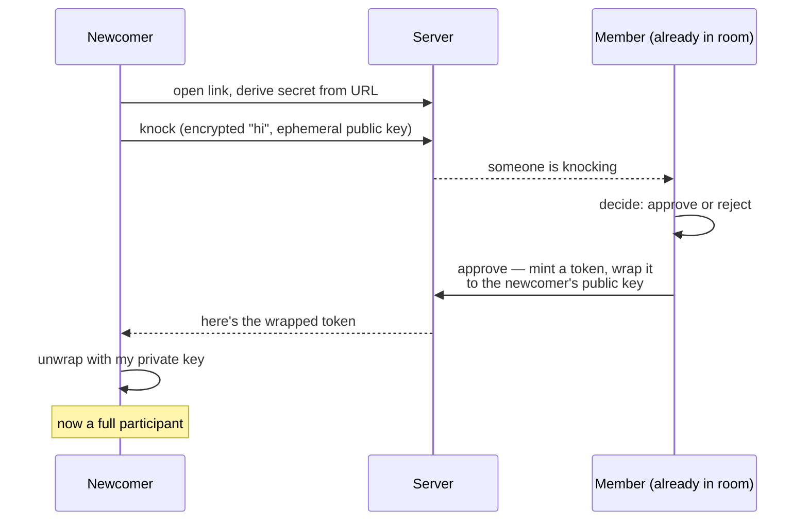
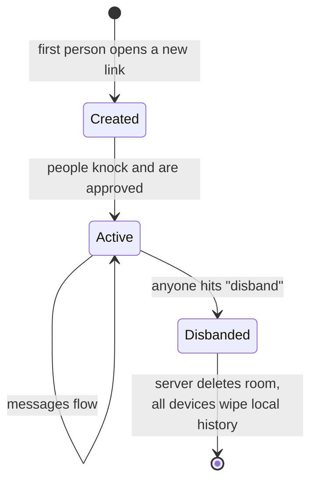
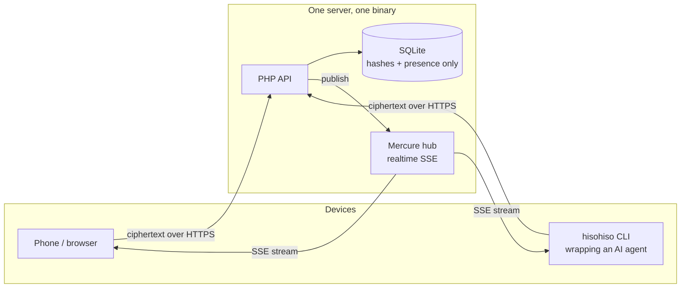

# Overview — the mental model

Before any code: hold these four ideas and the rest of the system falls out of
them.

### 1. A room is just a secret

There's no "room object" you log into. A room *is* a 32-byte random secret. If
you know the secret, you're in. If you don't, the room may as well not exist —
the server won't even confirm it's there in a way that helps you.

### 2. The URL is the password

The secret lives in the URL fragment — the part after the `#`:

```
https://hisohiso.org/abc123...thesecret...
                     ^ everything here is the secret
```

Browsers never send the fragment to the server. It's not in request lines, not
in logs, not in `Referer` headers. So "share the room" and "share the password"
are the same action: you send someone the link.

The server only ever learns the **room hash** — `SHA-256("hisohiso.room_hash" +
secret)`. From the hash you can't get back to the secret, and you can't decrypt
anything. The server uses the hash purely as a routing key: "which room does
this ciphertext belong to."

### 3. Nobody is in charge

There's no owner, no admin. Everyone in a room is equal text in the same room.
Two consequences:

- **Anyone can approve** a newcomer who knocks.
- **Anyone can disband** the room — and when they do, the server deletes it and
  every connected device wipes its local copy.

That's deliberate. It's a tool for people who already trust each other, not a
platform with moderation.

### 4. The server is dumb on purpose

The server routes ciphertext and remembers the bare minimum (which room hashes
exist, who's currently present). It cannot read a single message. Lose every
device that holds a room's history and that history is gone — there is no
cloud copy to recover.

---

## How someone joins: knock → approve

You can't just walk into a room that already has people in it. You **knock**,
and someone inside **approves**. The clever part is that approving hands you a
private token *without the server ever seeing it* — see
[encryption.md](encryption.md) for the crypto. The shape:



Two things to notice:

- The server relays a **wrapped** token. Only the newcomer can unwrap it. A
  passive eavesdropper on the room's event stream learns nothing usable.
- If the room is *empty* (no one present), the newcomer just joins — there's
  nobody to knock to.

## The lifecycle of a room



A room also quietly ages out: the server tracks `last_activity_at`, so abandoned
rooms can be reaped. Activity is whatever touches the room — a message, a knock,
a presence ping.

## Where the pieces live



The phone and the CLI are peers — they speak the exact same encrypted protocol.
That's the whole trick behind the CLI: your terminal AI agent shows up in a room
as just another participant. See [cli.md](cli.md).

Next: [encryption.md](encryption.md) — how the privacy actually holds up.
