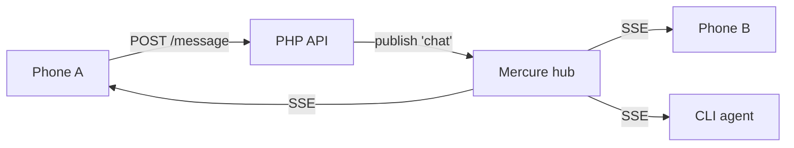
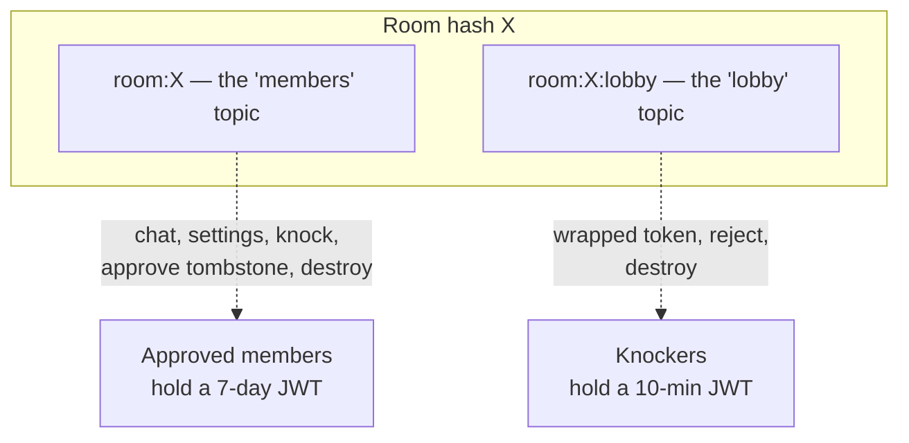

# Realtime

Chat needs a push channel: when someone sends a message, everyone else should
see it without polling. hisohiso uses **Mercure** — a small pub/sub protocol
built on Server-Sent Events (SSE). It's embedded right in FrankenPHP, so it's
not a separate service to run.

The model is plain:

- The **client subscribes** to a topic over a long-lived SSE connection (a GET
  that never closes; the server streams events down it).
- The **PHP API publishes** events to the hub after handling a POST.
- The hub fans each event out to every subscriber whose token allows that topic.



The client side is a custom `EventSource` (the `eventsource` npm polyfill, so
we can attach an `Authorization` header) wired up in `app/src/lib/mercure.ts`.
The publish side is `publish_event*()` in `server/mercure.php`, which POSTs
form-encoded events to the hub with a publisher JWT.

## Two topics per room

This is the one design decision worth understanding. Each room has **two**
topics, not one:



Why split them? Because anyone can knock, and knocking has to return *some*
subscriber token so the newcomer can receive their wrapped participant token.
If that token let them subscribe to the members topic, an attacker could knock
once and then quietly read chat ciphertext for 10 minutes. So:

- **Members topic** (`room:<hash>`) carries the actual conversation. Only
  approved participants ever get a JWT scoped to it.
- **Lobby topic** (`room:<hash>:lobby`) carries only the things a knocker
  legitimately needs: their wrapped token, a possible rejection, and the
  destroy signal. A knocker's JWT is scoped to *just* this topic and lives ~10
  minutes.

`destroy` is published to **both** topics, so an in-flight knocker also tears
down their waiting screen when the room is disbanded.

## The JWTs

Mercure won't take anonymous subscribers. Every SSE connection presents a JWT
whose `mercure.subscribe` claim lists exactly the topics it's allowed. Events
are published `private`, so the hub checks each delivery against the
subscriber's claim — a JWT for one room is useless for another.

| JWT | Scope | TTL | Who gets it |
| --- | --- | --- | --- |
| Subscriber (participant) | `room:<hash>` | ~7 days | Approved members, on create / approve / refresh |
| Subscriber (lobby) | `room:<hash>:lobby` | ~10 min | Knockers, on `POST /knock` |
| Publisher | the topic being written | per-request | The PHP API only; never leaves the server |

There's no per-JWT revocation (Mercure doesn't support it). Revocation happens
by **deletion**: disband the room and no further events publish to its topics,
and the short TTLs bound the damage of a leak. A participant whose 7-day JWT
expires just calls `/sub-token` for a fresh one.

## Keeping connections alive

Mobile networks and proxies love to silently kill idle connections — sometimes
eating the TCP FIN so neither side notices. Two mechanisms handle it:

- The hub sends a `: heartbeat` comment every 30s (configured in the
  `Caddyfile`), so an idle SSE connection always produces *some* bytes.
- The client (and the CLI's `sse-client.ts`) runs a stall watchdog: if no bytes
  arrive for ~90s, assume the socket is dead and reconnect.

## Event shape

Every published event is the same envelope:

```json
{
  "v": 0,
  "type": "chat",
  "room_hash": "…",
  "from": "<sha-256 of sender token, or null>",
  "ts": 1730000000123,
  "body": { "encrypted_payload": "…", "msg_id": "…" }
}
```

`ts` is in milliseconds so two events fired in the same second still sort in
emission order. `from` is a hash, never a name. `body` is whatever the event
type carries — for `chat` it's the opaque ciphertext; for `approve` it's empty.

Next: [offline-catchup.md](offline-catchup.md) — what happens to messages sent
while you were offline.
