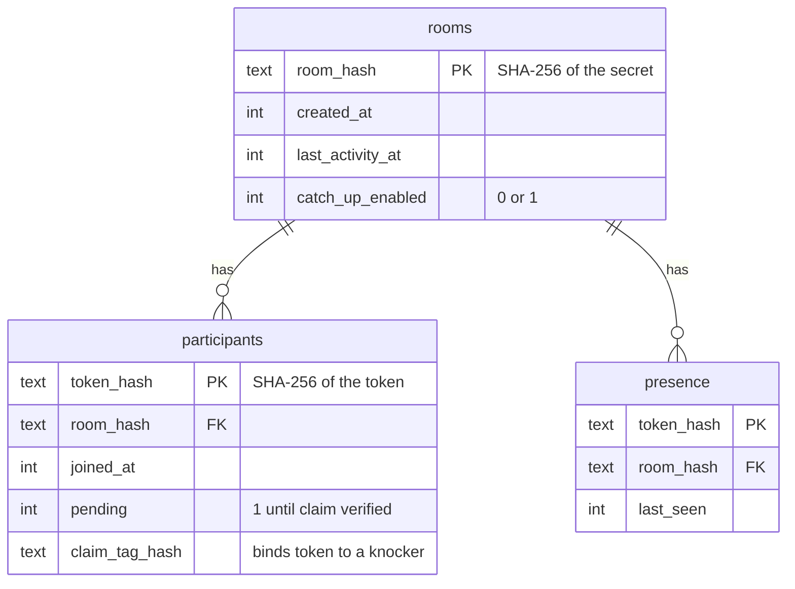
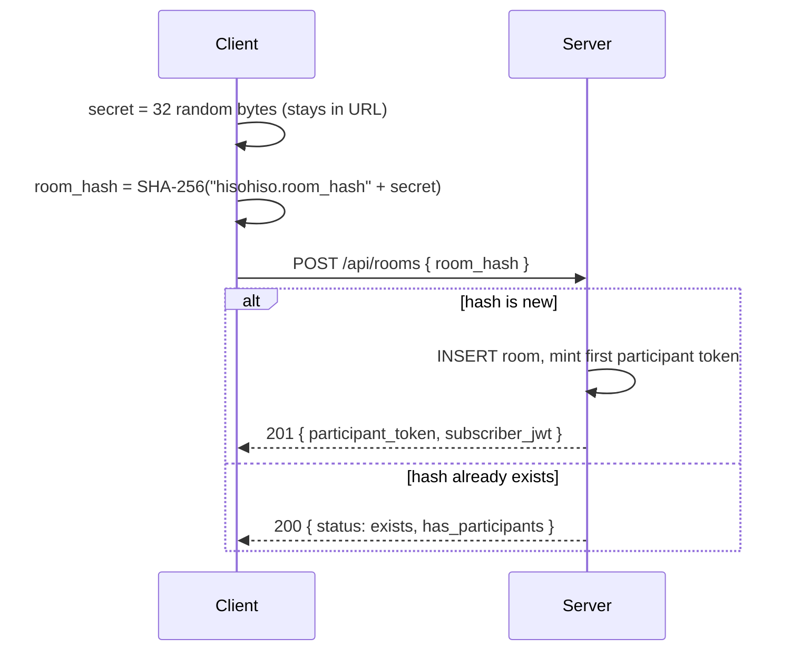

# The server

One PHP file does the routing (`server/index.php`), with three helpers:
`db.php` (SQLite), `mercure.php` (publishing realtime events + signing JWTs),
and `outbox.php` (the optional catch-up store — see
[offline-catchup.md](offline-catchup.md)). No framework. Every request hits the
single front controller, which dispatches by path and method.

It runs inside FrankenPHP, which also embeds the Mercure hub and the web
server — see [stack-and-server.md](stack-and-server.md) for why that's one
binary instead of three.

## What the server stores

Three tiny SQLite tables in `/data/chat.sqlite` (WAL mode). That's the whole
authoritative state of the system.

Look at what's *not* there: no messages, no usernames, no secrets, no plaintext
tokens. Just hashes and timestamps. Deleting a room cascades and takes its
participants and presence with it.

- **rooms** — a room exists if its hash is in this table. `last_activity_at`
  lets abandoned rooms be reaped.
- **participants** — one row per issued token, stored as a hash. `pending` and
  `claim_tag_hash` implement the anti-race protection from
  [encryption.md](encryption.md).
- **presence** — who's been seen lately. The PWA pings `/presence` every ~20s;
  rows older than 45s count as gone. This is sampled, not authoritative — which
  is why the DB is tuned for cheap writes (`synchronous = NORMAL`) and presence
  writes are throttled to avoid lock contention.

## The API

Base path `/api`. Everything that touches a room takes an `X-Chat-Token` header
(the participant token); the server hashes it and checks the `participants`
table. A token that's still `pending` is rejected everywhere **except**
`/presence`, which is the one place it gets claimed and activated.

| Method & path | Auth | What it does |
| --- | --- | --- |
| `GET /api/stats` | none | Public counters: total rooms, active rooms, active people |
| `POST /api/rooms` | none | Create a room (if the hash is new) or report whether it exists & has people. Creator gets the first token + a subscriber JWT. |
| `GET /api/rooms/{hash}` | none | Does this room exist, does it have anyone in it, is catch-up on |
| `POST /api/rooms/{hash}/knock` | none | Request entry. Publishes an encrypted knock to members; returns a short-lived **lobby** JWT |
| `POST /api/rooms/{hash}/approve` | token | Mint a *pending* token bound to the knocker's claim-tag hash. Body of the published event is empty (a tombstone). |
| `POST /api/rooms/{hash}/token` | token | Deliver the wrapped token to the knocker on the lobby topic |
| `POST /api/rooms/{hash}/reject` | token | Tell the knocker "no" — content-free, lobby topic only |
| `POST /api/rooms/{hash}/presence` | token | Heartbeat. Also the claim path: a pending token activates here if it presents the right `X-Chat-Claim-Tag` |
| `POST /api/rooms/{hash}/sub-token` | token | Re-mint a subscriber JWT for an existing participant whose JWT expired |
| `POST /api/rooms/{hash}/message` | token | Publish a chat ciphertext to the room (and append to the outbox if catch-up is on) |
| `GET /api/rooms/{hash}/outbox` | token | Fetch missed messages since a timestamp (catch-up) |
| `POST /api/rooms/{hash}/settings` | token | Flip catch-up on/off. Turning it off wipes the stored ciphertext. |
| `POST /api/rooms/{hash}/disband` | token | Delete the room. Wipes its outbox, fans a `destroy` event to everyone. |

### Room creation, concretely

The hash must match `^[0-9a-f]{64}$` or it's a `400 invalid_room_hash` — the
server won't store anything it didn't derive-check.

## What the server can and can't see

Worth stating flatly, because it's the point of the whole design.

**Can see:** room hashes, token hashes, rough presence (who's active, when),
counts for the public stats page, and the size/timing of ciphertext flowing
through. Metadata, in other words.

**Cannot see:** message contents, room secrets, participant tokens in the
clear, usernames or any profile, or message history (it doesn't keep one —
unless catch-up is on, and then only ciphertext, capped and short-lived).

A compromised server can disrupt a room (drop messages, refuse knocks, delete
it) and can do traffic analysis. It cannot read what people are saying. That's
the security boundary.

## Errors and ops touches

A top-level exception handler turns any uncaught throw — including SQLite
`database is locked` under contention — into a logged trace plus a clean
`{"error": "internal_error"}` envelope, so the PWA always gets JSON instead of
a bare 500. Production PHP is configured to log errors to a file in the data
volume and never display them to clients. The Mercure JWT keys **fail closed**:
if they're left at the default placeholder, the server refuses to serve rather
than ship a forgeable hub.

Next: [realtime.md](realtime.md) — how events actually reach the clients.
