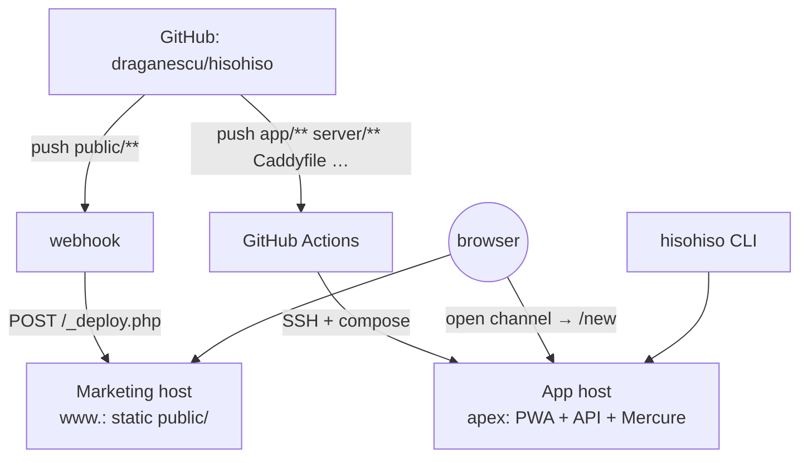

# Split hosting — marketing site vs. app

By default everything ships in one container. This page describes the optional
**two-host** layout, without tying the architecture to any specific hosting
provider:

| Host role | Domain | Serves | Deploy flow |
| --- | --- | --- | --- |
| **App host** | `hisohiso.org` (apex) | the React PWA + `/api/*` + Mercure | app deploy workflow (`.github/workflows/deploy.yml`) |
| **Marketing host** | `www.hisohiso.org` | the static marketing/content site (`public/`) | push webhook → `_deploy.php` does `git pull` |

It's one repo. Each host pulls only its own slice, and each deploy flow only
fires for its own paths — a marketing edit never rebuilds the app container,
and an API change never touches the marketing host.



The apex keeps the app on purpose: existing `hisohiso.org/room#…` links, paired
phones, and CLI configs all keep working — the split only moves the static
pages out to `www`.

## What changed in the repo to enable this

- **Container stopped serving marketing content.** `Dockerfile` no longer `COPY`s
  `public/`; `compose.yaml` / `compose.prod.yaml` dropped the `./public` mount;
  the Caddyfile `@landing` block and the `www → apex` redirect were removed
  (`www` now points at the marketing host instead). `/` on the app host falls
  through to the React app's own landing.
- **Cross-host links made absolute.** The content pages' "open channel" CTAs
  (`href="/new"`) became `https://hisohiso.org/new`, because the React app no
  longer lives on the same origin as the content site. Their `og:image` URLs
  point at `www` (the apex no longer serves `og.png`). Internal content links
  stay relative.
- **CLI default** stays `https://hisohiso.org`.
- **App deploy workflow path-filtered** so a `public/**`-only push doesn't
  redeploy the app host.
- **`public/_deploy.php`** added — a generic PHP push-hook receiver for the
  marketing host.

## Marketing host setup (one-time, over SSH)

Use any web host that can serve PHP from `public/`, read a secret outside the
served docroot, and run `git` from PHP via `shell_exec`.

1. Clone the repo under your home dir (not inside a web directory):
   ```sh
   git clone https://github.com/draganescu/hisohiso.git ~/repos/hisohiso
   ```
2. Set `www.hisohiso.org`'s **web directory** to `~/repos/hisohiso/public` so
   the served docroot *is* `public/`.
3. Write the shared webhook secret to the **repo root** (one level above the
   docroot, so it's never web-served; it's also `.gitignored`):
   ```sh
   openssl rand -hex 32 > ~/repos/hisohiso/.deploy-secret
   chmod 600 ~/repos/hisohiso/.deploy-secret
   ```
4. Confirm PHP can shell out: `php -r 'var_dump(function_exists("shell_exec"));'`
   should print `true`. If it's `false`, use the cron fallback below.

## Push webhook setup

Repo → **Settings → Webhooks → Add webhook**:

- **Payload URL:** `https://www.hisohiso.org/_deploy.php`
- **Content type:** `application/json`
- **Secret:** the same value you wrote to `.deploy-secret`
- **Events:** "Just the push event"

The receiver verifies the `X-Hub-Signature-256` HMAC, ignores anything that
isn't a push to `main`, then fast-forwards the checkout. Output is appended to
`~/repos/hisohiso/.deploy.log`. Use the webhook's "Recent Deliveries" tab to
redeliver and debug. (Set `HISOHISO_DEPLOY_BRANCH` if you deploy a branch other
than `main`.)

### Fallback if `shell_exec` is disabled

Some web hosts block exec from PHP. If so, skip the webhook and add a cron job
that polls instead:

```sh
*/5 * * * * cd ~/repos/hisohiso && git fetch --prune origin main && git reset --hard origin/main >> .deploy.log 2>&1
```

## App host changes

The app stays on the apex — no DNS or `SERVER_NAME` change on the app host.
What does change:

1. Confirm the deploy workflow secrets for your app host are set:
   - `DO_SSH_KEY`
   - `DO_HOST`
   - `DO_USER`
   - `DO_APP_DIR`
   - `DO_SSH_PORT` (optional; defaults to `22`)
2. Deploy as usual — push, or run `scripts/deploy.sh` on the box. After this
   deploy the container no longer serves the content pages or answers for
   `www`.

## Cutover order (avoid downtime)

1. **Marketing host first:** clone, set the web directory for
   `www.hisohiso.org`, write the secret, add the webhook. The host will serve
   it as soon as DNS arrives.
2. **Move `www` DNS:** repoint `www.hisohiso.org` from the app host to the
   marketing host. Until the app changes deploy, the old container still
   redirects any stragglers hitting it for `www` to the apex — harmless.
3. **Deploy the app changes:** merge this PR / push — the container rebuild
   drops the landing pages and the `www` site block. Verify
   `https://hisohiso.org/rooms` serves the PWA and
   `https://hisohiso.org/api/stats` responds.
4. **Verify the split:** `https://www.hisohiso.org` serves the content site,
   its "open channel" CTAs land on `https://hisohiso.org/new`, and an old
   `hisohiso.org/room#…` link still opens.

Do **not** deploy the app changes before moving `www` DNS: once the container
drops the `www` block, Caddy has no certificate or site for `www` requests
that still resolve to the app host, and they'll fail TLS instead of
redirecting.
