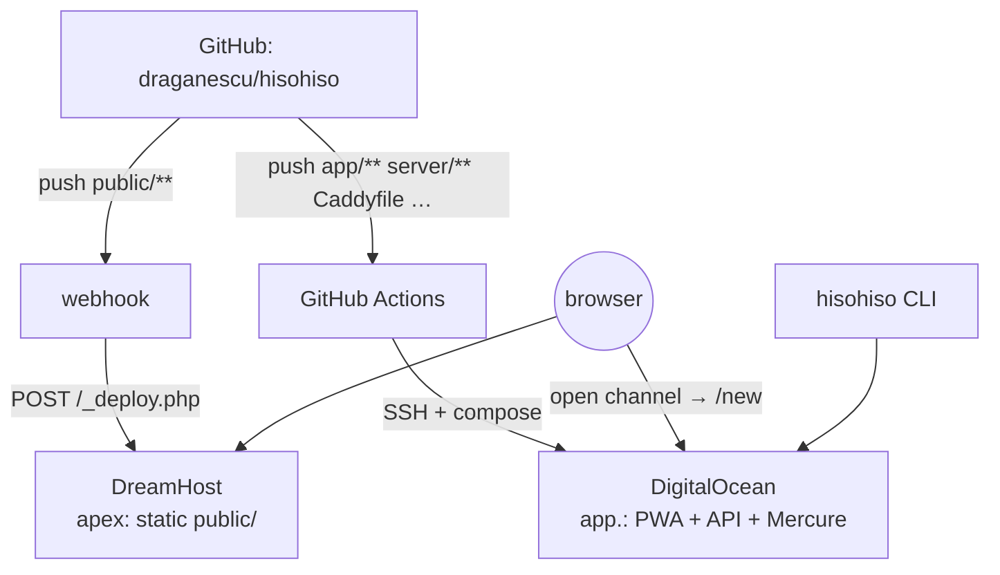

# Split hosting — content site vs. app

By default everything ships in one container. This page describes the optional
**two-host** layout:

| Host | Domain | Serves | Deploy flow |
| --- | --- | --- | --- |
| **DreamHost** (shared) | `hisohiso.org` (+ `www`) | the static content site (`public/`) | **GitHub webhook** → `_deploy.php` does `git pull` |
| **DigitalOcean** (droplet) | `app.hisohiso.org` | the React PWA + `/api/*` + Mercure | **GitHub Actions** (`.github/workflows/deploy.yml`) |

It's one repo. Each host pulls only its own slice, and each deploy flow only
fires for its own paths — a marketing edit never rebuilds the container, and an
API change never touches DreamHost.



## What changed in the repo to enable this

- **Container stopped serving content.** `Dockerfile` no longer `COPY`s
  `public/`; `compose.yaml` / `compose.prod.yaml` dropped the `./public` mount;
  the Caddyfile `@landing` block and the `www` redirect were removed. `/` on the
  app host now falls through to the React app's own landing.
- **Cross-host links made absolute.** The content pages' "open channel" CTAs
  (`href="/new"`) became `https://app.hisohiso.org/new`, because the React app
  no longer lives on the same origin. Internal content links stay relative.
- **CLI default** points at `https://app.hisohiso.org`.
- **GitHub Action path-filtered** so a `public/**`-only push doesn't redeploy DO.
- **`public/_deploy.php`** added — the DreamHost webhook receiver.

## DreamHost setup (one-time, over SSH)

1. Clone the repo under your home dir (not inside a web directory):
   ```sh
   git clone https://github.com/draganescu/hisohiso.git ~/repos/hisohiso
   ```
2. In the DreamHost panel, set `hisohiso.org`'s **web directory** to
   `~/repos/hisohiso/public` so the served docroot *is* `public/`. Point `www`
   at the same place (or redirect it to the apex).
3. Write the shared webhook secret to the **repo root** (one level above the
   docroot, so it's never web-served; it's also `.gitignored`):
   ```sh
   openssl rand -hex 32 > ~/repos/hisohiso/.deploy-secret
   chmod 600 ~/repos/hisohiso/.deploy-secret
   ```
4. Confirm PHP can shell out: `php -r 'var_dump(function_exists("shell_exec"));'`
   should print `true`. If it's `false`, use the cron fallback below.

## GitHub webhook setup

Repo → **Settings → Webhooks → Add webhook**:

- **Payload URL:** `https://hisohiso.org/_deploy.php`
- **Content type:** `application/json`
- **Secret:** the same value you wrote to `.deploy-secret`
- **Events:** "Just the push event"

The receiver verifies the `X-Hub-Signature-256` HMAC, ignores anything that
isn't a push to `main`, then fast-forwards the checkout. Output is appended to
`~/repos/hisohiso/.deploy.log`. Use the webhook's "Recent Deliveries" tab to
redeliver and debug. (Set `HISOHISO_DEPLOY_BRANCH` if you deploy a branch other
than `main`.)

### Fallback if `shell_exec` is disabled

Some shared-hosting plans block exec from PHP. If so, skip the webhook and add a
DreamHost cron job that polls instead:

```sh
*/5 * * * * cd ~/repos/hisohiso && git fetch --prune origin main && git reset --hard origin/main >> .deploy.log 2>&1
```

## DigitalOcean changes

The droplet moves from the apex to the `app.` subdomain:

1. Add a DNS **A record** `app.hisohiso.org → <droplet IP>` (managed at
   DreamHost, where your DNS lives).
2. Set `SERVER_NAME=app.hisohiso.org` in the droplet's `.env` so Caddy fetches a
   cert for the new hostname. (The Mercure JWT keys are injected by the Action.)
3. Deploy as usual — push, or run `scripts/deploy.sh` on the box.

## Cutover order (avoid downtime)

1. **DreamHost first:** clone, set the web directory, secret, webhook. Verify
   `https://hisohiso.org` still resolves to DO for now — don't move DNS yet.
2. **Stand up the app subdomain:** add the `app.` A record, set `SERVER_NAME`,
   deploy the app changes. Verify `https://app.hisohiso.org` serves the PWA and
   `https://app.hisohiso.org/api/stats` responds.
3. **Flip the apex:** repoint `hisohiso.org` (+ `www`) DNS to DreamHost. Once it
   propagates, the apex serves the content site and `app.` serves the PWA.
4. Tell existing users / re-issue any shared room links from the `app.` host.
   Old `hisohiso.org/room#…` links break once the apex moves — only the
   `app.hisohiso.org` origin runs the React app now.
