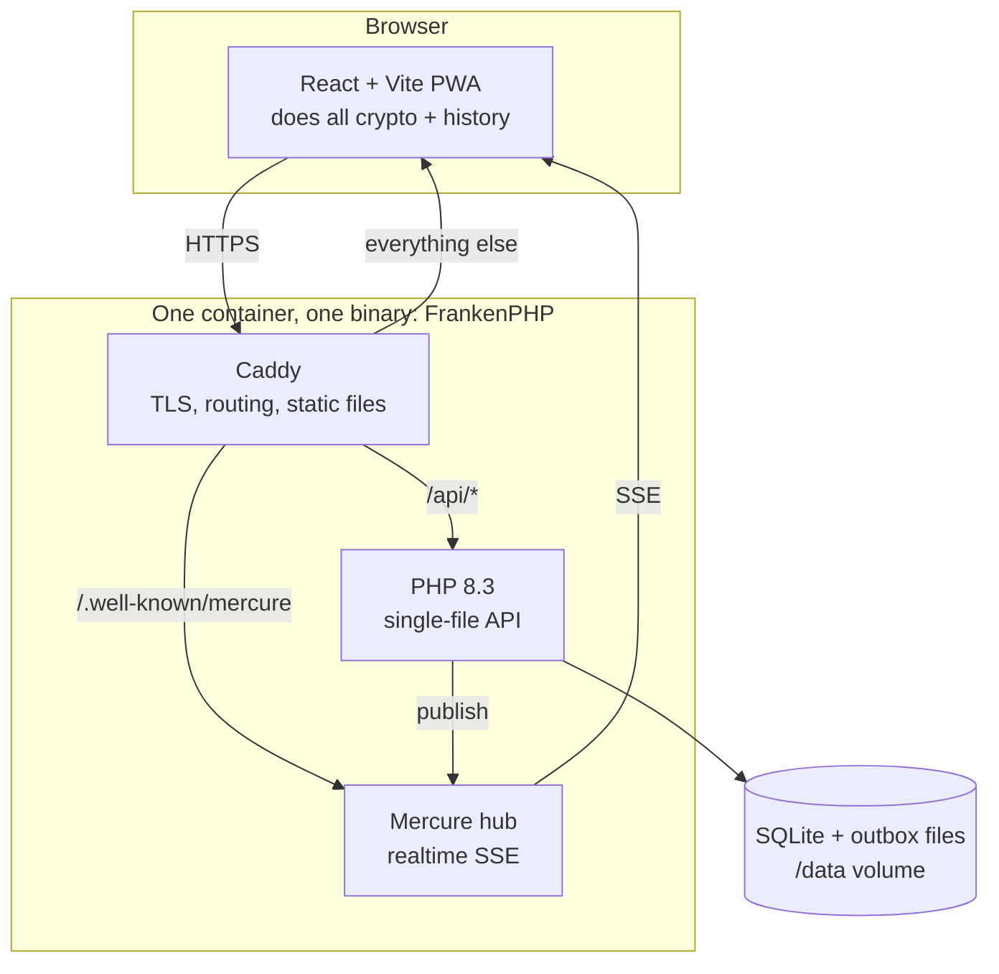
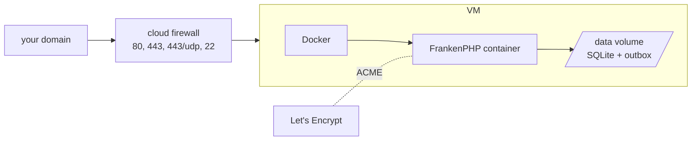

# The stack & recommended server setup

This is the page to read if you're going to run hisohiso yourself. It covers
what each piece of the stack is, why it's there, and how to deploy and harden a
production host. For the step-by-step host-provisioning runbook, see
[host-bootstrap.md](host-bootstrap.md).

## The stack at a glance



| Layer | Choice | Why this one |
| --- | --- | --- |
| Web server / TLS | **Caddy** (inside FrankenPHP) | Automatic HTTPS via Let's Encrypt, HTTP/3, simple config. No nginx + certbot dance. |
| Realtime | **Mercure** (inside FrankenPHP) | SSE pub/sub as a Caddy module — no separate websocket service to run or supervise. |
| App runtime | **FrankenPHP** (PHP 8.3) | Bundles Caddy + Mercure + PHP into one process. See the honest note below. |
| API | **Single-file PHP**, no framework | The API is a thin router over SQLite. A framework would be more moving parts than logic. |
| Database | **SQLite** (WAL mode) | The authoritative state is tiny (hashes + presence). One file, no DB server to run, trivially backed up. |
| Frontend | **React + Vite**, built to static files | Served as plain static assets by Caddy. All the real work is client-side anyway. |
| Packaging | **Docker + Compose** | One image, one volume. `compose.prod.yaml` layers production ports/hardening over the base. |

### An honest note on FrankenPHP

FrankenPHP earns its place here as **glue, not as a speed engine**: it collapses
what would otherwise be three services (a web server, a Mercure hub, and
PHP-FPM) into one binary and one container. For a small self-hostable app that's
the real win.

What it is *not* doing: **worker mode is off.** There's no `worker` directive,
so each `/api/*` request boots the PHP front controller fresh (classic mode).
That's a deliberate, fine trade-off — the API is a tiny single-file router over
SQLite, so boot cost is negligible and you avoid worrying about leaked global
state between requests. Just know that FrankenPHP's headline throughput feature
is intentionally unused; if you ever dropped Mercure, plain Caddy + PHP-FPM
would do nearly the same job.

## How requests get routed

The `Caddyfile` splits traffic three ways under one hostname:

- `/api/*` → the PHP front controller (`server/index.php`, which lives at
  `/app/public/api/index.php` in the image).
- `/.well-known/mercure` → the Mercure hub.
- everything else → static files: the landing page, then the React app
  (`try_files … /index.html` so client-side routes work).

A couple of hardening choices baked into the config, worth knowing before you
edit it:

- **`admin off`** disables Caddy's admin API (`:2019`). We never `caddy reload`
  — every deploy rebuilds the container — so the admin endpoint would be pure
  attack surface (it holds the Mercure keys in cleartext).
- A strict **CSP** (`connect-src 'self'`, `frame-ancestors 'none'`) so that an
  XSS in some future dependency can't exfiltrate the room secret from
  `location.hash` or clickjack the approval UI.
- Version-fingerprinting headers (`Server`, `X-Powered-By`) are stripped.

## Configuration you must set

Production reads these from the environment (see `.env.example`):

| Variable | What | Notes |
| --- | --- | --- |
| `SERVER_NAME` | Your public hostname | Caddy uses it to get a TLS cert |
| `MERCURE_PUBLISHER_JWT_KEY` | HMAC key for publishing | **Must not** be the default — the server fails closed if it is |
| `MERCURE_SUBSCRIBER_JWT_KEY` | HMAC key for subscribing | Same |
| `MERCURE_HUB_URL` | Where PHP POSTs events | Usually the in-container `/.well-known/mercure` |
| `CHAT_DB_PATH` | SQLite path | Defaults to `/data/chat.sqlite` |

The two Mercure keys are the security-critical ones: if they leak, someone can
forge subscriber JWTs. The server refuses to start serving if they're left at
the `!ChangeMe!` placeholder — better a loud 500 than a silent compromise.

## Recommended production setup

The recommended shape is a **single small Linux VM**, Docker installed, this repo
cloned, `.env` filled in. The state is so small that one box with snapshots is plenty — there's
no database server, no cache, no queue to scale out.



### Bring it up

```bash
cp .env.example .env          # then fill in SERVER_NAME + the two Mercure keys
docker compose -f compose.yaml -f compose.prod.yaml up -d --build
```

`compose.prod.yaml` adds the things you want only in production:

- Publishes `80`, `443`, **and `443/udp`** (the UDP port is what makes HTTP/3
  actually work, not just advertised).
- `restart: unless-stopped`.
- A real healthcheck that curls `/api/stats` over HTTPS (the image's default
  healthcheck probes the admin API we disabled, so it's replaced).
- `no-new-privileges` and **read-only** code bind-mounts, so a compromised
  container can't rewrite PHP source on the host.

The base image is pinned to `dunglas/frankenphp:1-php8.3` and deploys build with
`--pull`, so each deploy picks up the latest FrankenPHP / Caddy / PHP patch
without chasing a moving `latest` tag. `scripts/deploy.sh` is the one-command
version of the build-and-up step.

### Hardening the host

TLS is automatic once DNS points at the box and the container is up — Caddy
fetches and renews Let's Encrypt certs on its own. The rest of the host
hardening (non-root deploy user, fail2ban, ufw, unattended upgrades, locking
down SSH) is scripted and documented in
[host-bootstrap.md](host-bootstrap.md). The short version:

1. `scripts/bootstrap-host.sh` — idempotent; sets up the firewall, auto-updates,
   and a non-root deploy user. Safe to re-run.
2. Verify you can deploy as that user.
3. `scripts/lockdown-sshd.sh` — disables root SSH. The one destructive step;
   do it only after step 2 succeeds from a second terminal.

### Backups

The entire authoritative state is the `/data` volume (the SQLite file plus any
per-room outbox files). Snapshot the volume — provider snapshots or a
`borg`/`restic` job to another host. There's nothing else to back up; message
history lives on users' devices, not on the server.

### Running your own, pointed at by the CLI

If you self-host, point the CLI at your deployment:

```sh
hisohiso server https://your-host.example.com
```

Everything in [cli.md](cli.md) then works against your server instead of
`hisohiso.org`.
